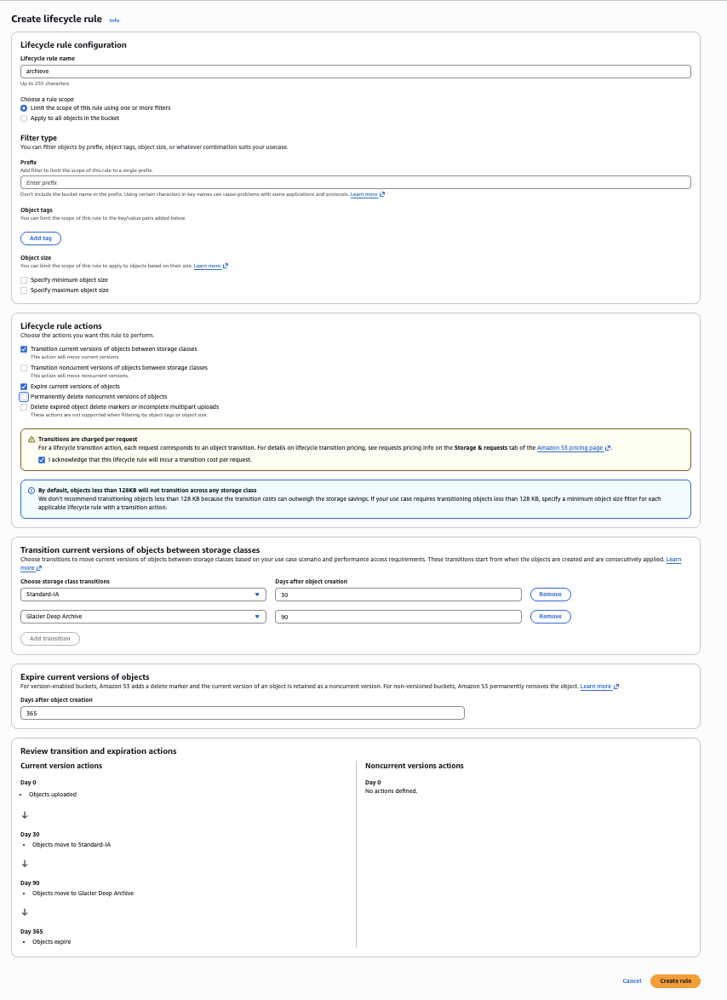

# Centralized Logging

VPC Flow Logs, ALB logs, and CloudTrail to centralized S3 with lifecycle policies.

## 1. Create Log Bucket

**Console:** S3 → Create bucket
- Name: `centralized-logs'
- Region: us-east-1
- Enable: Versioning

**Console:** S3 → Bucket → Management → Lifecycle rules
- Rule: `archive`
- 30 days → STANDARD_IA
- 90 days → GLACIER
- 365 days → Delete

## 2. VPC Flow Logs

**Console:** VPC → Flow logs → Create flow log
- Resource type: VPC
- Filter: All traffic
- Destination: S3 bucket
- Bucket: `centralized-logs-<account-id>/vpc-flow-logs/`

## 3. ALB Access Logs

**Console:** EC2 → Load balancers → Select ALB → Attributes → Edit
- Access logs: Enable
- S3 bucket: `centralized-logs-<account-id>`
- S3 prefix: `alb-logs/`

## 4. CloudTrail

**Console:** CloudTrail → Trails → Create trail
- Name: `audit-trail`
- Storage location: S3 bucket `centralized-logs-<account-id>/cloudtrail/`
- Multi-region trail: Yes
- Log file validation: Yes

