# Hub-and-Spoke VPC

Hub VPC (10.0.0.0/16) + 2 Spoke VPCs with peering. Spokes only talk to Hub, not each other.

## 1. Create VPCs

**Console:** VPC → Create VPC
- Name: `Hub`
- CIDR: 10.0.0.0/16
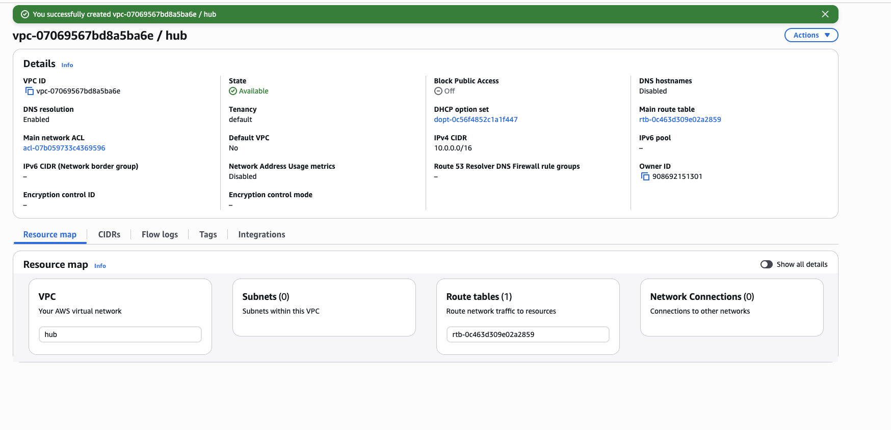

**Console:** VPC → Create VPC
- Name: `Spoke-A`
- CIDR: 10.1.0.0/16
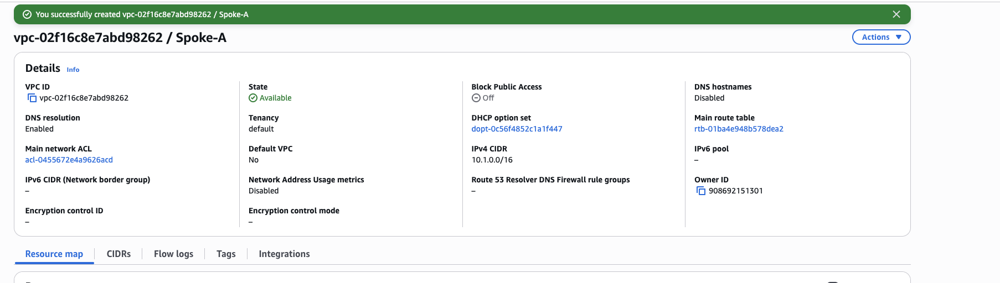

**Console:** VPC → Create VPC
- Name: `Spoke-B`
- CIDR: 10.2.0.0/16
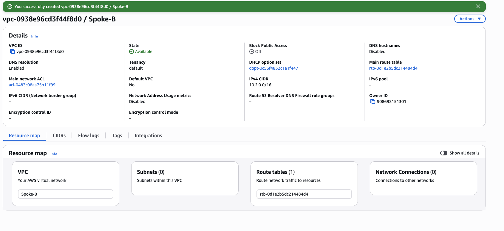

## 2. Create Peering Connections

**Console:** VPC → Peering connections → Create
- Name: `Hub-to-Spoke-A`
- VPC (Requester): Hub
- VPC (Accepter): Spoke-A
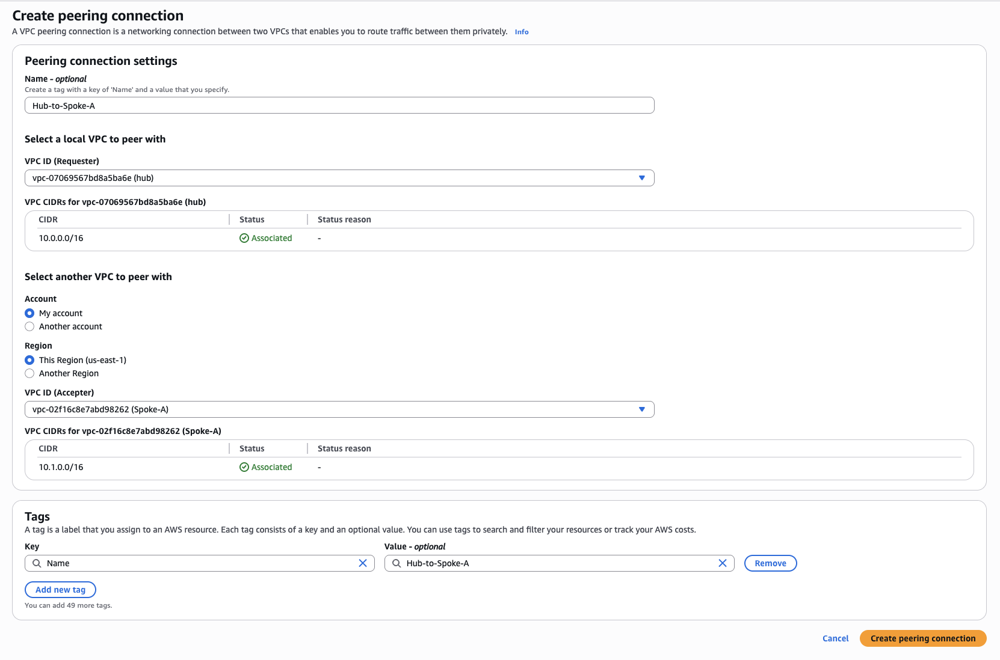
- Accept the peering
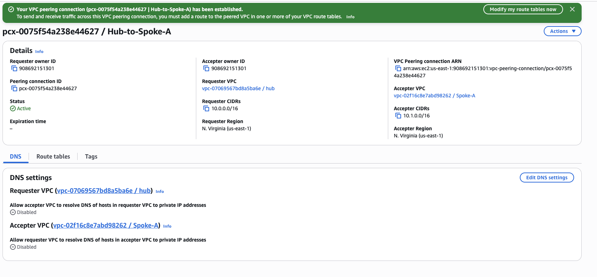

**Console:** VPC → Peering connections → Create
- Name: `Hub-to-Spoke-B`
- VPC (Requester): Hub
- VPC (Accepter): Spoke-B
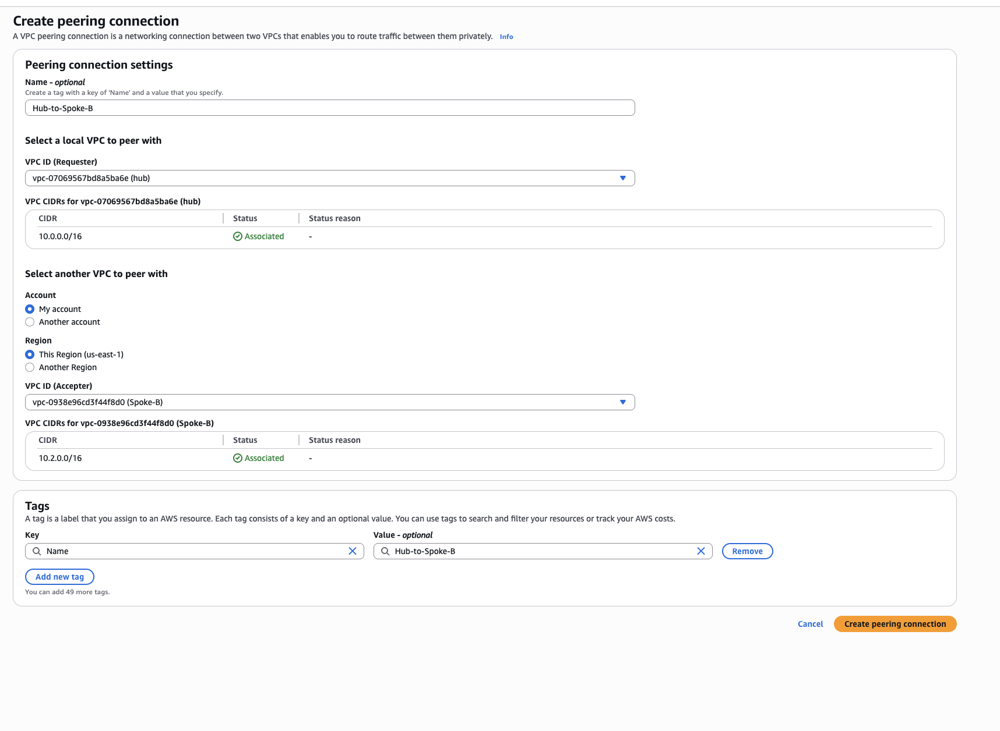
- Accept the peering
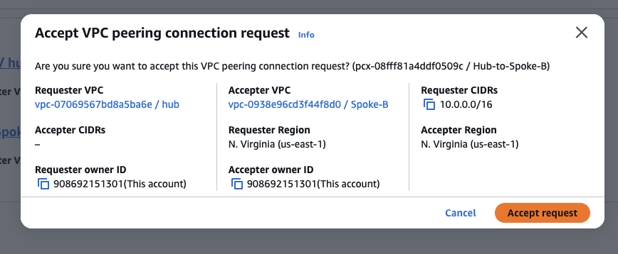
## 3. Configure Routes

**Console:** VPC → Route tables → Hub main RT → Routes → Edit
- Destination: 10.1.0.0/16 → Peering connection (Hub-to-Spoke-A)
- Destination: 10.2.0.0/16 → Peering connection (Hub-to-Spoke-B)
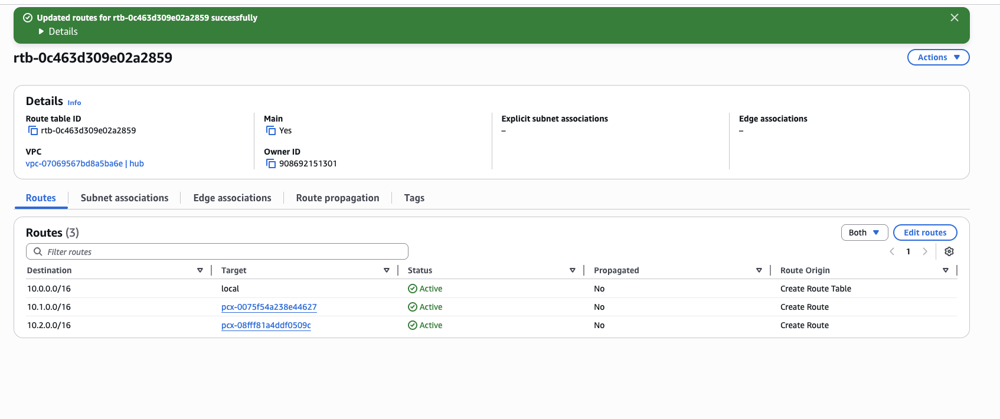

**Console:** VPC → Route tables → Spoke-A RT → Routes → Edit
- Destination: 10.0.0.0/16 → Peering connection (Hub-to-Spoke-A)
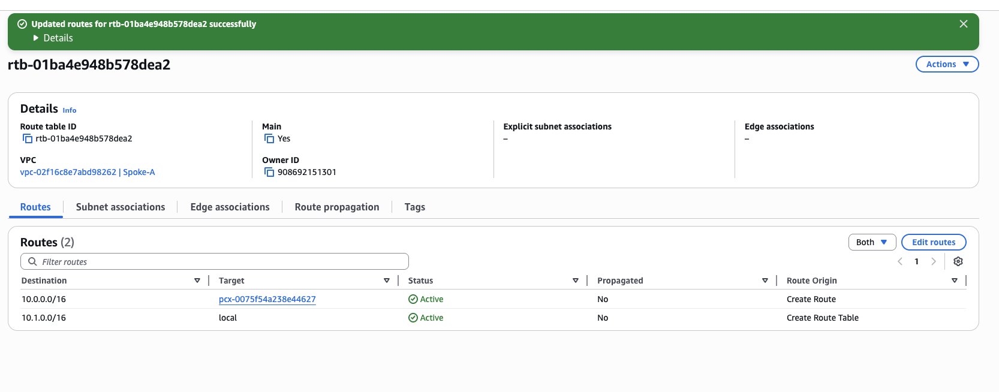
**Console:** VPC → Route tables → Spoke-B RT → Routes → Edit
- Destination: 10.0.0.0/16 → Peering connection (Hub-to-Spoke-B)
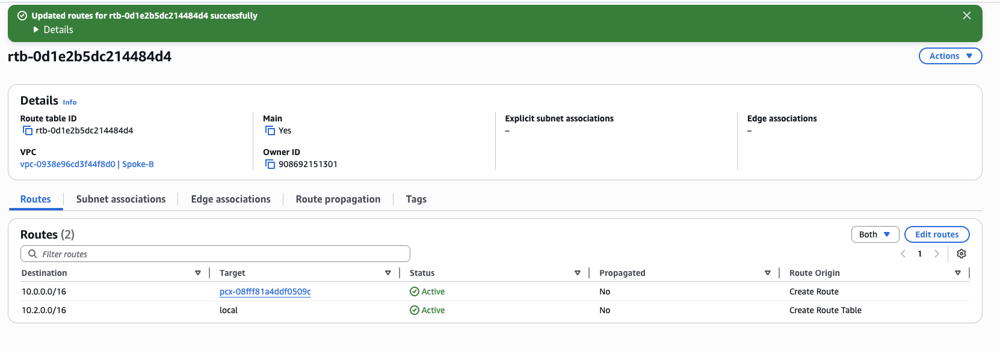

## 4. Security Groups

**Console:** EC2 → Security groups → Create (Hub)
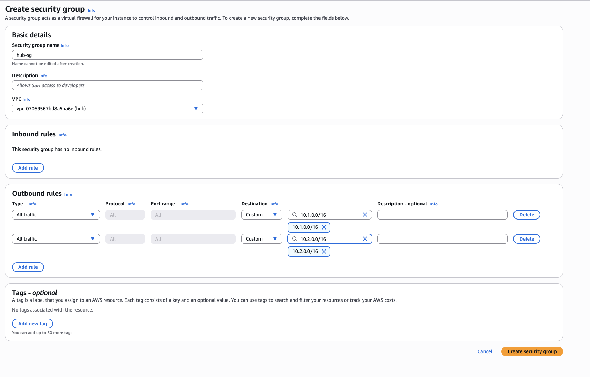

**Console:** EC2 → Security groups → Create (Spoke-A)
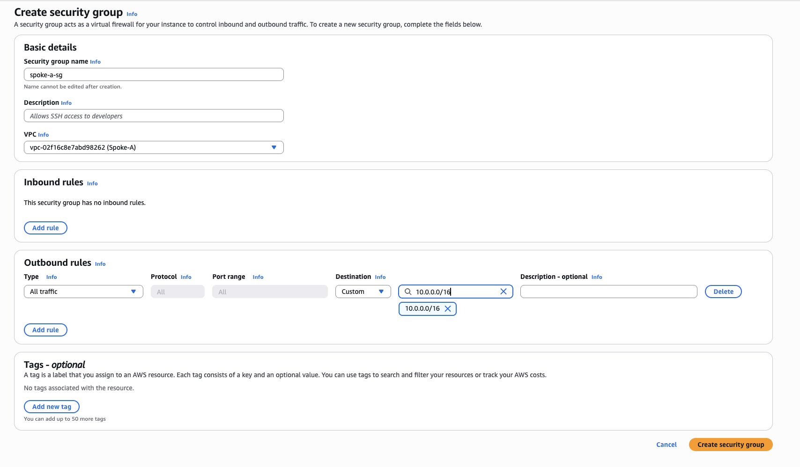

**Console:** EC2 → Security groups → Create (Spoke-B)
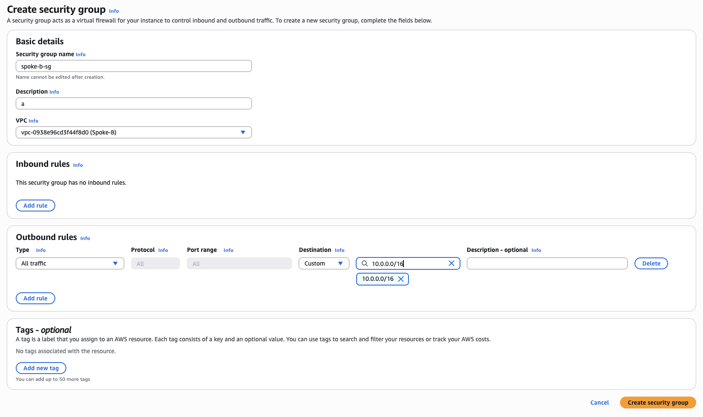

## 5. Test Instances

**Console:** EC2 → Launch instances in each VPC
- Hub: t2.micro, `hub-sg`, Hub subnet
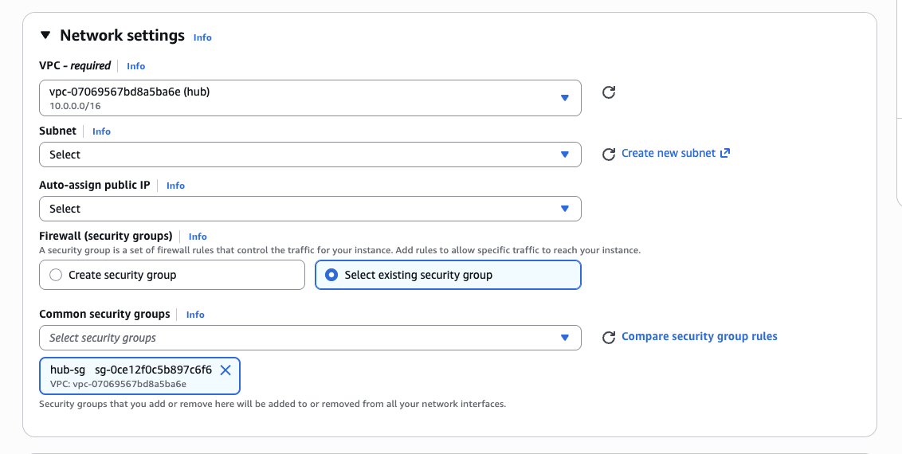
- Spoke-A: t2.micro, `spoke-a-sg`, Spoke-A subnet
- Spoke-B: t2.micro, `spoke-b-sg`, Spoke-B subnet

## 6. Test Connectivity

- From Spoke-A: ping Hub (works)
- From Spoke-A: ping Spoke-B (fails - no route by design)
- From Hub: ping both spokes (works)

