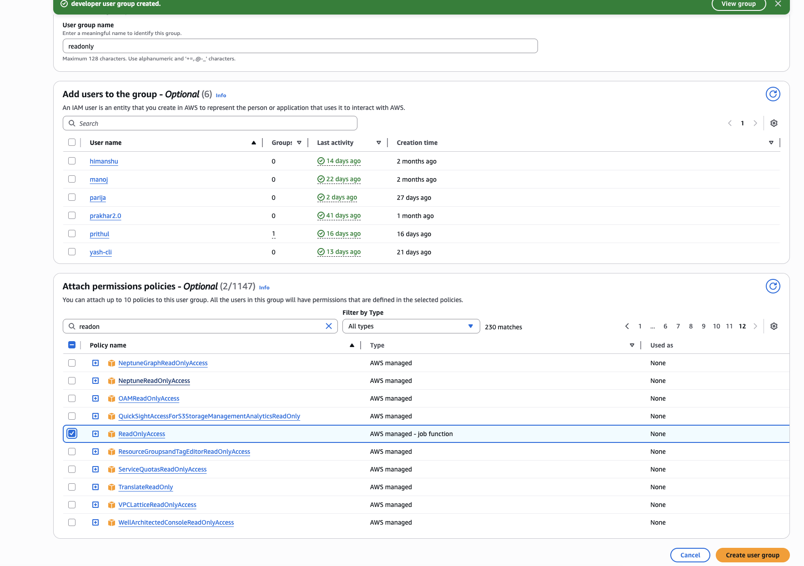
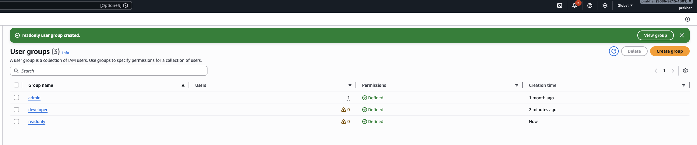
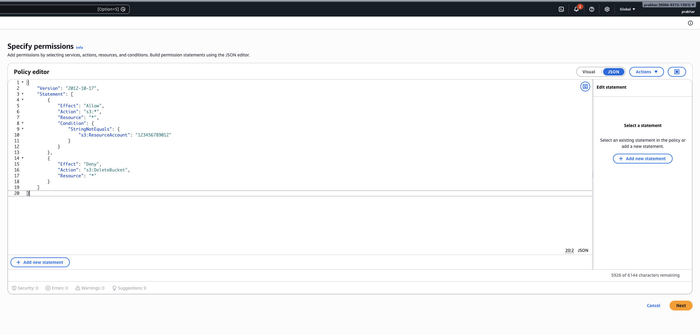
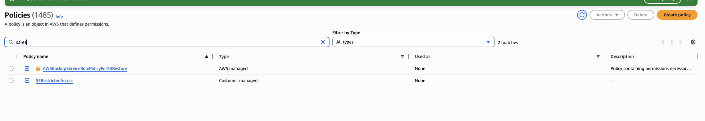
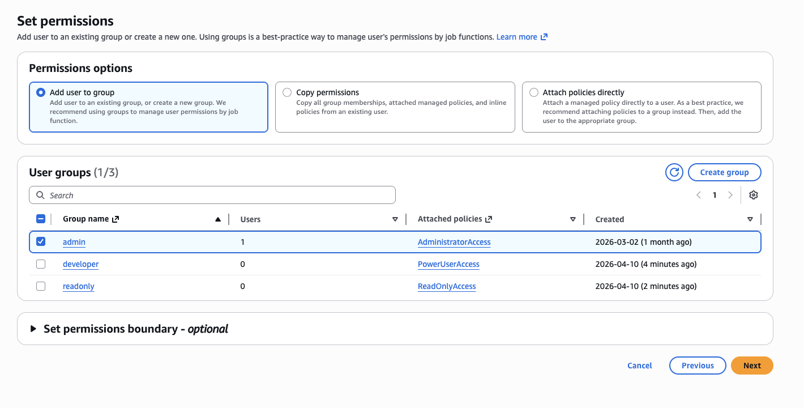
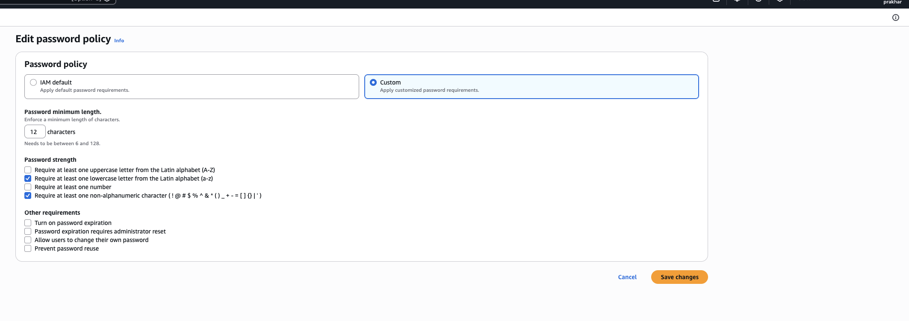

# IAM Best Practices

Quick setup for IAM groups, MFA, and least privilege policies.

## 1. Enable MFA for Root

1.png

## 2. Create Groups

**Console:** IAM → User groups → Create group
- Name: `Admins`
- Attach policy: AdministratorAccess

- Name: `Developers`
- Attach policy: PowerUserAccess

- Name: `ReadOnly`
- Attach policy: ReadOnlyAccess

## 3. Custom S3 Restricted Policy

**Console:** IAM → Policies → Create policy → JSON

- Name: `S3RestrictedAccess`

## 4. Create Users

## 5. Password Policy

