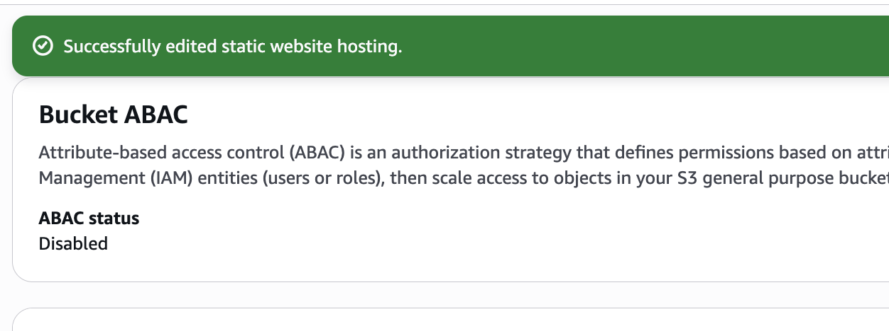
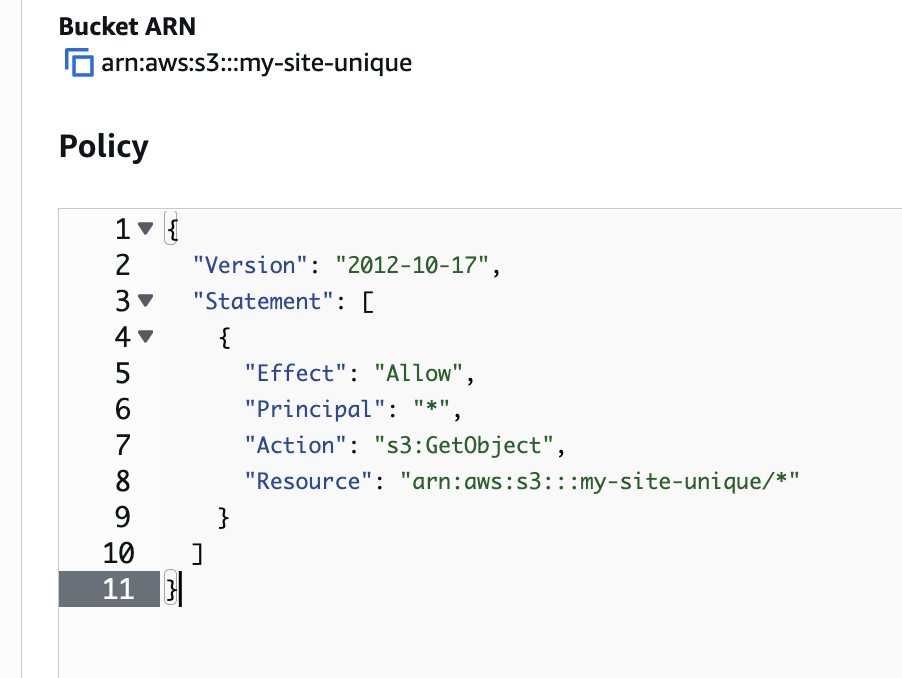

# S3 Static Website

Quick setup for hosting a static site on S3.

## 1. Create Bucket

**Console:** S3 → Create bucket
- Name: `my-site-unique`
- Region: us-east-1
- Disable: Block all public access
- Enable: Versioning

## 2. Enable Website Hosting

**Console:** S3 → Bucket → Properties → Static website hosting → Edit
- Enable
- Index document: `index.html`
- Error document: `error.html`

## 3. Set Public Access Policy

**Console:** S3 → Bucket → Permissions → Bucket policy → Edit

## 4. Upload Files

**Console:** S3 → Bucket → Upload
- index.html
- error.html
- assets/

## 5. Access Website

**Console:** S3 → Bucket → Properties → Static website hosting
- URL: `http://my-site-unique.s3-website-us-east-1.amazonaws.com`

