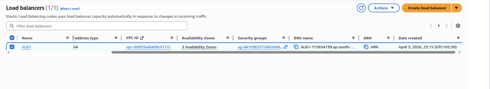
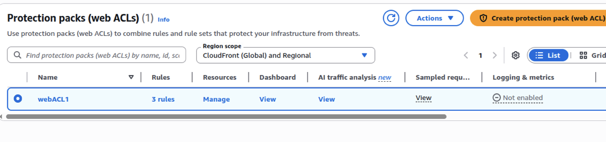

# Web Application Firewall (WAF)

Attach WAF to ALB with SQL injection, rate limiting, and geo-blocking rules.

## 1. Create WebACL

**Console:** WAF & Shield → Web ACLs → Create Web ACL
- Name: `my-webacl`
- Scope: Regional
- Default action: Allow
- Add rules:
  - AWS Managed Rules → SQL injection (Priority 1)
  - Rate limiting: 1000 requests/5min per IP (Priority 2)
  - Geographic match: Block KP, IR, SY (Priority 3)
  
  

## 2. Associate with ALB

**Console:** WAF & Shield → Web ACLs → `my-webacl` → Associated AWS resources → Add resources
- Select your ALB from the list

## 3. Enable Logging

**Console:** CloudWatch → Log groups → Create log group
- Name: `/aws/waf/my-webacl`

**Console:** WAF & Shield → Web ACLs → `my-webacl` → Logging and metrics → Enable logging
- Destination: CloudWatch Logs
- Log group: `/aws/waf/my-webacl`

